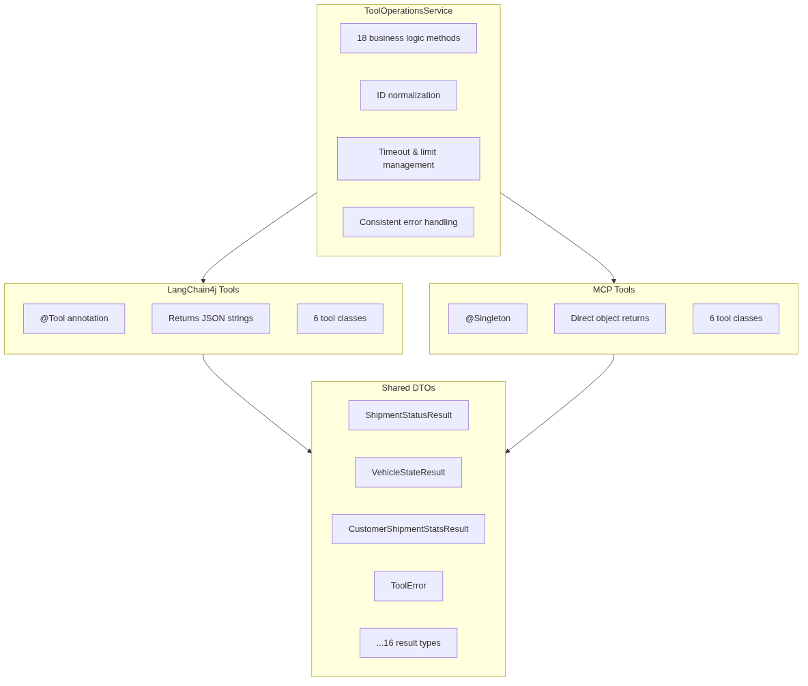
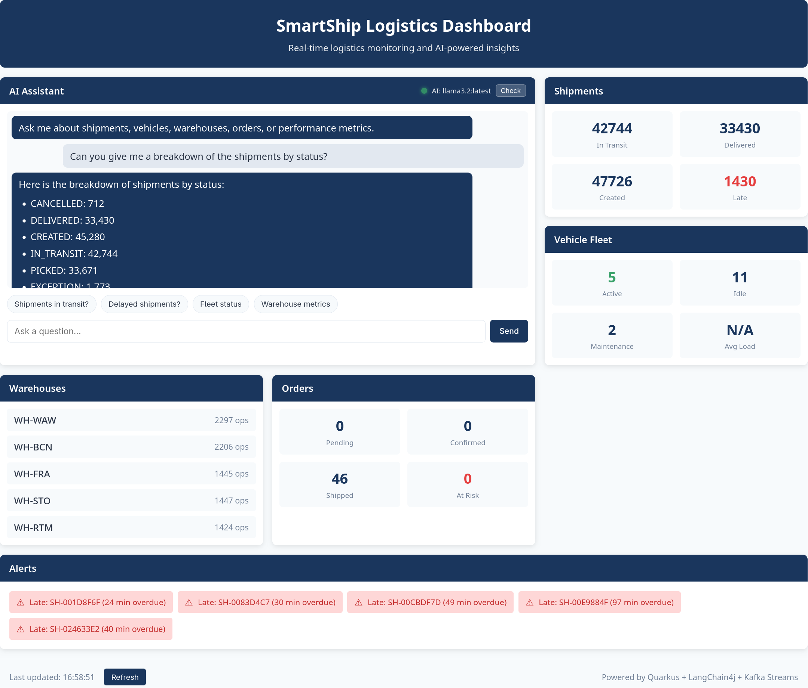

# Real-time Context Demo

## Introduction

Systems like [Apache Kafka](https://kafka.apache.org/) allow organisations to develop event driven architectures, which allow businesses to react to changes in real time. 
While these systems provide a flexible way to implement new business processes on top of low latency data streams, it can often be difficult to analyse the state of those streams and get a clear picture of the data as it exists _now_.

Typically, companies will load the streams from Kafka topics into an analytical database, like Google Big Table or a datalake based on Open Table Formats like Apache Iceberg, and query the data from there.
Alternatively, if it is a common query, they might create specific extract-transform-load (ETL) jobs using Kafka client libraries in bespoke microservices or create a dedicated stream processing job using systems like Apache Flink.

This process can be quite involved and requires time to implement and tune. 
A simpler alternative can be to create materialized versions of key data streams using Kafka Streams tables and exposing their state stores.
This allows the current state of the streams to be queried by various tools, including AI agents.

Agents (be they based on large language models or humans writing queries) work best with the most up-to-date context. 
Using the latest materialized state of data streams composed of key business events, provides a way to get the most relevant up-to-date data to agents so they can answer queries as accurately as possible.

This walk-through describes an example business use case for materialized streams and how these can be configured to be accessible by an AI agent to answer queries about the current state of the business.

## SmartShip

The use case in the walk-through is based on the fictional company SmartShip, which is a logistics and fulfilment company based in Europe.
The company employees 75 drivers, operating 50 vehicles, out of 5 warehouse spread across several countries in Europe.
They deliver over 10,000 products to 200 customers.

SmartShip has implemented an event driven architecture. 
All the vehicles report their locations back to head office at least every minute, the warehouses are fully instrumented and each shipment's status is updated in real-time.
Customers issue orders, which contain one or more shipments, via the order management system.


There are 4 key Kafka topics in the system:

- order.status: Every time the status of a customer order changes, a message is posted to this topic containing the customer, order and shipment IDs and the new status of the order:
    - `RECEIVED`
    - `VALIDATED`
    - `ALLOCATED`
    - `SHIPPED`
    - `DELIVERED`
    - `CANCELLED`
    - `RETURNED`
    - `PARTIAL_FAILURE`
    - The state of an order only changes once all the shipments within it have moved to the new state.
- shipment.events: This is similar to the order status topic but for the individual shipments (packages) which make up an order. Messages on this topic include the customer and shipment IDs, source and destination information and the status of the shipment:
    - `CREATED`
    - `PICKED`
    - `PACKED`
    - `DISPATCHED`
    - `IN_TRANSIT`
    - `OUT_FOR_DELIVERY`
    - `DELIVERED`
    - `EXCEPTION`
    - `CANCELLED`
- vehicle.telemetry: Each vehicle updates head office at least once a minute. They provide location, speed and heading information as well as the current vehicle status:
    - `IDLE`
    - `EN_ROUTE`
    - `LOADING` 
    - `UNLOADING`
    - `MAINTENANCE`
- warehouse.ops: Each warehouse is instrumented to report operations on shipments. The messages in this topic include the warehouse location, product and shipment IDs and the type of operation being performed which include:
    - `RECEIVING`
    - `PUTAWAY`
    - `PICK`
    - `PACK`
    - `LOAD`
    - `INVENTORY_ADJUSTMENT`
    - `CYCLE_COUNT`

Each topic has an associated Avro message schema (you can see these in the `schemas` module in the demo repository) and these are registered in an [Apicurio Registry](https://www.apicur.io/registry/) instance.

## Real-time State

The data in these four topics represents the current state of the SmartShip business. 
Downstream of these topics, many different business processes can be attached. 
For critical business operations the shipment and order events will be persisted in a relational database.
However, the people in charge of SmartShip know that this data has more to offer than just facilitating the day-to-day operation of the company.
For example the vehicle telemetry could be loaded into a timeseries database for visualisation and routing analytics.
The orders and shipment events could be loaded into Apache Iceberg tables to allow for analysis of customer purchasing trends.
However, those analytical requirements mean running additional databases and datalake systems, their associated infrastructure and the tooling to extract and load the events into them.
What if we would like to see the state of the streams with less infrastructure and crucially less latency?

One option for this is using Kafka Streams and its [Interactive Queries](https://kafka.apache.org/41/streams/developer-guide/interactive-queries/) functionality.
This allows users to write relatively simple Kafka Streams queries that materialize a stream of data as a table-like structure. 
This table can then be exposed via a server and the value of specific keys, or ranges of keys, queried in real time.

### Kafka Streams Materialized Views

Kafka Streams provides a powerful abstraction called a [KTable](https://kafka.apache.org/41/javadoc/org/apache/kafka/streams/kstream/KTable.html), which represents a changelog stream as a table.
Each record in the underlying stream represents an update to the table, and the KTable maintains the latest value for each key.
When combined with state stores, KTables become queryable materialized views of your streaming data.

For example, to answer the question "How many shipments are currently in each of the possible shipment states?", SmartShip can create a KTable that reads the `shipment.events` topic and counts shipments grouped by their ShipmentEventType:

```java
KTable<String, Long> shipmentCountsByStatus = shipmentStream
    .groupBy(
        (key, value) -> value.getEventType().toString(),
        Grouped.with(Serdes.String(), shipmentEventSerde)
    )
    .count(
        Materialized.<String, Long, KeyValueStore<Bytes, byte[]>>as("active-shipments-by-status")
            .withKeySerde(Serdes.String())
            .withValueSerde(Serdes.Long())
    );
```

This code:

1. Reads from the `shipment.events` stream
2. Re-keys each event by its status (e.g., `IN_TRANSIT`, `DELIVERED`)
3. Counts the events per key
4. Materializes the result into a named state store

The state store is automatically updated as new events arrive, providing a real-time count of shipments in each status that can be queried at any time.
For more complex queries, aggregations can build custom objects. 
For instance, to track per-customer shipment statistics, an aggregate function can maintain a running total of shipments, deliveries, and exceptions for each customer.

### Kafka Streams Interactive Queries

Once data is materialized into state stores, Kafka Streams' Interactive Queries feature allows these stores to be queried directly without needing to export the data to an external database.
This provides low query latency on the current state of your streams.

However, Interactive Queries introduce a complication when using a Kafka Streams deployment which has been scaled out (multiple running instances of the Kafka Streams application). 
Kafka Streams distributes the partitions of the application's input topic(s) across multiple application instances, which means any given key's state might reside on a different instance than the one receiving the query.
If you have three streams-processor instances, querying for `VEH-001`'s current state requires knowing which instance holds that vehicle's partition.

Kafka Streams provides functionality to help developers solve this issue. 
Each instance of a streams application can set a `application.server` configuration values which specifies a `host:port` address for that instance.
Kafka Streams applications can then call methods like [`metadataForAllStreamsClients`](https://kafka.apache.org/41/javadoc/org/apache/kafka/streams/KafkaStreams.html#metadataForAllStreamsClients()) on the `KafkaStreams` instance to receive a [`StreamsMetadata`](https://kafka.apache.org/41/javadoc/org/apache/kafka/streams/StreamsMetadata.html) object for each application instance.
This allows an overall view of the state store and partition distribution across the application.
For a more direct query, applications can call [`queryMetadataForKey`](https://kafka.apache.org/41/javadoc/org/apache/kafka/streams/KafkaStreams.html#queryMetadataForKey(java.lang.String,K,org.apache.kafka.common.serialization.Serializer)) to receive specific information on where a given key is located.

While this functionality allows a streams application to locate which instance a given key is on, that is only part of the story. 
You still need to be able to route queries to the appropriate store.
For individual keys this is relatively straight forward, you can query any application instance for the key's location and once found issue the request to that instance. 
However, you often need to query a range of keys and so you need to implement a system that can handle aggregating the various look-up requests.

So to provide a production ready Kafka Streams based interactive query system, you need to provide application side RPC endpoints for discovering metadata and serving key and/or key range requests. 
You then also need somewhere to host the logic for discovering, querying and aggregating the data from the distributed state stores.
This logic could be in a library used by the querying entity or could be hosted in a central service which querying entities then call.

## Implementing the Interactive Queries

In this project we have opted for providing a centralised query services which handles the distributed query logic and provides a single REST API for querying the Kafka Streams instances.
There are two key parts of this architecture:


1. **Streams Processor (Interactive Query Server)**: `streams-processor/src/main/java/com/smartship/streams/InteractiveQueryServer.java`
   
   Each instance of the Stream Processor application hosts an instance of our custom _Interactive Query Server_ which implements endpoints for each of the state stores.
   They also each provide a metadata endpoint which the Query Gateway can use to discover key locations:

   - `/metadata/instances/{storeName}` - Lists all instances hosting a store
   - `/metadata/instance-for-key/{storeName}/{key}` - Finds the specific instance for a key

2. **Query API (Gateway)**: `query-api/src/main/java/com/smartship/api/KafkaStreamsQueryService.java`

   A stateless Quarkus-based service that:

   - Discovers all streams-processor instances via Kubernetes headless service DNS
   - Health-checks each instance to build a list of available nodes
   - Routes key-specific queries to the correct instance using metadata lookups
   - Aggregates results across all instances for queries that span multiple partitions

This architecture allows the Query API to provide a unified interface to clients while the streams-processor instances scale horizontally, each managing its portion of the partitioned state.

### An example query

To show the process end-to-end, let's walk through how the system answers the question: **"How many shipments are currently in each status?"**

This query requires aggregating data from multiple partitions that may be distributed across different streams-processor instances, making it a good example of how the interactive query architecture handles distributed state.

#### Step 1: Creating the Materialized View (KTable)

The `LogisticsTopology` class creates a materialized view by consuming the `shipment.events` topic and counting shipments by their status:

```java
KTable<String, Long> shipmentCountsByStatus = shipmentStream
    .groupBy(
        (_, value) -> value.getEventType().toString(),
        Grouped.with(Serdes.String(), shipmentEventSerde)
    )
    .count(
        Materialized.<String, Long, KeyValueStore<Bytes, byte[]>>as("active-shipments-by-status")
            .withKeySerde(Serdes.String())
            .withValueSerde(Serdes.Long())
    );
```

This code:

1. Re-keys each shipment event by its status (e.g., `IN_TRANSIT`, `DELIVERED`, `EXCEPTION`)
2. Groups all events with the same status key together
3. Counts the number of events per status
4. Materializes the result into a named state store called `active-shipments-by-status`

As new shipment events arrive, the counts are automatically updated in real-time.
The keys for this store will be distributed between the instances of the Kafka Streams application.

#### Step 2: Interactive Query Server Endpoints

Each streams-processor instance runs an `InteractiveQueryServer` that exposes HTTP endpoints for querying its local state store partition.
This includes an endpoint for returning the current state of the `active-shipments-by-status` store: 

```java
server.createContext("/state/active-shipments-by-status", this::handleActiveShipmentsByStatus);
```

```java
private void handleActiveShipmentsByStatus(HttpExchange exchange) throws IOException {
    
    ...

    ReadOnlyKeyValueStore<String, Long> store = streams.store(
            StoreQueryParameters.fromNameAndType(
                    "active-shipments-by-status",
                    QueryableStoreTypes.keyValueStore()
            )
    );

    // Query all statuses from this instance's partition
    Map<String, Long> counts = new LinkedHashMap<>();
    for (ShipmentEventType status : ShipmentEventType.values()) {
        Long count = store.get(status.name());
        counts.put(status.name(), count != null ? count : 0L);
    }
    sendJsonResponse(exchange, counts); 
    
    ...
}
```

The server also provides metadata endpoints that the Query API uses to discover the location of particular keys:

- `GET /metadata/instances/{storeName}` - Returns all instances hosting partitions of a store
- `GET /metadata/instance-for-key/{storeName}/{key}` - Finds which instance holds a specific key

#### Step 3: Query API Gateway Aggregation

The Query API acts as a gateway that coordinates queries across all streams-processor instances. 
First, it discovers healthy instances via DNS (see `query-api/src/main/java/com/smartship/api/services/StreamsInstanceDiscoveryService.java`):

```java
// Resolve all IPs for the headless Kubernetes service
InetAddress[] addresses = InetAddress.getAllByName(headlessService);

for (InetAddress address : addresses) {
    String instanceUrl = UriBuilder.newInstance()
        .scheme("http")
        .host(address.getHostAddress())
        .port(port)
        .build()
        .toString();

    if (isInstanceHealthy(instanceUrl)) {
        healthyInstances.add(instanceUrl);
    }
}
```

Then it queries all instances in parallel and merges the results (see `getAllStatusCounts` in `query-api/src/main/java/com/smartship/api/KafkaStreamsQueryService.java`):

```java
// Create parallel futures to query each instance
List<CompletableFuture<Map<String, Long>>> futures = instances.stream()
    .map(instance -> CompletableFuture.supplyAsync(
        () -> queryJsonNumberMap(instance, "/state/active-shipments-by-status"),
        executorService
    ))
    .collect(Collectors.toList());

// Wait for all queries to complete
CompletableFuture.allOf(futures.toArray(new CompletableFuture[0])).join();

// Merge counts from all instances (sum values for each status)
Map<String, Long> mergedCounts = new HashMap<>();
for (CompletableFuture<Map<String, Long>> future : futures) {
    Map<String, Long> instanceCounts = future.get();
    instanceCounts.forEach((status, count) ->
        mergedCounts.merge(status, count, Long::sum)
    );
}
```

#### Query Flow Diagram

The following diagram illustrates the complete flow when a client requests shipment counts by status:


The key point to understand here is that because the state store is partitioned by key across instances, no single instance has the complete picture.
The Query API (unless it is looking for a single key) has to aggregate results from all the Kafka Streams instances in order to provide an accurate answer.
For queries that target a specific key (e.g., "What is the count for IN_TRANSIT?"), the Query API can use the metadata endpoint to route the request directly to the instance holding that key's partition.

### Other queries

The SmartShip streams-processor maintains nine state stores in total, each designed to answer specific business questions:

**Shipment Tracking**

| State Store                  | Question Answered                                         |
|------------------------------|-----------------------------------------------------------|
| `active-shipments-by-status` | How many shipments are in each status right now?          |
| `shipments-by-customer`      | What are the shipment statistics for a specific customer? |
| `late-shipments`             | Which shipments are past their expected delivery time?    |

**Fleet Management**

| State Store             | Question Answered                                 |
|-------------------------|---------------------------------------------------|
| `vehicle-current-state` | Where is a specific vehicle and what is it doing? |

**Warehouse Operations**

| State Store                   | Question Answered                                                       |
|-------------------------------|-------------------------------------------------------------------------|
| `warehouse-realtime-metrics`  | What operations have occurred at each warehouse in the last 15 minutes? |
| `hourly-delivery-performance` | What is the delivery performance for each warehouse over the past hour? |

**Order Management**

| State Store           | Question Answered                                      |
|-----------------------|--------------------------------------------------------|
| `order-current-state` | What is the current status of a specific order?        |
| `orders-by-customer`  | What are the order statistics for a specific customer? |
| `order-sla-tracking`  | Which orders are at risk of breaching their SLA?       |

Each state store uses an appropriate Kafka Streams pattern:

- **Counting stores** (like `active-shipments-by-status`) use `.count()` aggregations
- **Latest-value stores** (like `vehicle-current-state`) use `.reduce()` to keep only the most recent event
- **Aggregating stores** (like `shipments-by-customer`) use `.aggregate()` with custom accumulator objects
- **Windowed stores** (like `warehouse-realtime-metrics`) use time-based windows to provide metrics over specific time periods

These stores are exposed via the Query API with REST endpoints such as:

- `GET /api/shipments/status/all` - Returns counts for all shipment statuses
- `GET /api/vehicles/state/VEH-001` - Returns current state of vehicle VEH-001
- `GET /api/customers/CUST-0001/shipments` - Returns shipment stats for customer CUST-0001
- `GET /api/orders/sla-risk` - Returns all orders at risk of SLA breach

## Hybrid Queries

While streaming state stores are good at providing real-time aggregations, they don't contain all the context needed to answer complex business questions.
For example, knowing that `VEH-001` is currently at coordinates (52.5200, 13.4050) is useful, but an operator also needs to know the driver's name, the vehicle's capacity, and its home warehouse.

The system addresses this by combining Kafka Streams state stores with PostgreSQL reference data through hybrid queries.
The PostgreSQL database contains relatively static reference data across six tables: warehouses, customers, vehicles, drivers, products, and routes.
The Query API's `QueryOrchestrationService` coordinates queries across both data sources and merges the results.

For instance, the "enriched vehicle state" hybrid query:

1. Fetches the vehicle's reference data from PostgreSQL (type, capacity, home warehouse)
2. Retrieves the vehicle's real-time telemetry from the Kafka Streams state store (location, speed, status)
3. Looks up the assigned driver from PostgreSQL
4. Combines all data into a single response with a human-readable summary

```json
{
  "sources": ["postgresql", "kafka-streams"],
  "query_time_ms": 45,
  "data": {
    "vehicle": { "vehicle_id": "VEH-001", "type": "Van", "capacity_kg": 1500 },
    "current_state": { "status": "EN_ROUTE", "speed": 65.5, "location": {...} },
    "driver": { "name": "Jan Kowalski", "license_type": "C" }
  },
  "summary": "Vehicle VEH-001 (Van, 1500kg capacity) is EN_ROUTE at 65.5 km/h, driven by Jan Kowalski"
}
```

The Query API exposes hybrid queries through endpoints like:

- `GET /api/hybrid/customers/{id}/overview` - Customer details with real-time order and shipment stats
- `GET /api/hybrid/vehicles/{id}/enriched` - Vehicle reference data with current telemetry
- `GET /api/hybrid/warehouses/{id}/status` - Warehouse details with real-time operational metrics
- `GET /api/hybrid/orders/{id}/details` - Order information with customer and shipment context

## AI Agent Integration

Now that we have an API for querying the real-time state of SmartShip's operations, we can integrate this with an AI agent to answer natural language questions about the state of the business.

To achieve this, we need to connect a large language model (LLM) to our Query API so it can fetch the relevant data on demand.
There are many different ways we could implement this integration.
However, the two we will focus on in this demonstration are:

1. Using [LangChain4j](https://docs.langchain4j.dev/) to build an internal chatbot that employees can use to ask questions about logistics operations via an internally hosted LLM and interface. This chatbot will use tool/function calling to invoke specific API endpoints to get real-time data as needed, with all the data and inference occurring within the company's infrastructure.
2. Using [Model Context Protocol (MCP)](https://modelcontextprotocol.io) to expose the same capabilities to external AI agents via a standard interface. This allows SmartShip data engineers to easily create agentic pipelines with externally hosted LLMs and could also allow customers to connect their own AI assistants (e.g., Claude Desktop) to SmartShip's data via MCP tool calls, with the LLM processing happening on the customer's side.

### Multiple AI Interfaces

Having two access patterns is powerful, however it could lead to code duplication.
To address this, we extracted the business logic for querying the state stores via an LLM into a shared `ToolOperationsService`. 
This service becomes the single source of truth for all tool operations, regardless of which AI interface is calling them.



The `ToolOperationsService` (see `query-api/src/main/java/com/smartship/api/services/ToolOperationsService.java`) handles:

1. **ID Normalization**: LLMs often pass IDs in inconsistent formats. The service normalizes `"1"`, `"0001"`, or `"CUST-0001"` to the canonical `"CUST-0001"` format.
2. **Data Coordination**: Orchestrates calls to `KafkaStreamsQueryService`, `PostgresQueryService`, or `QueryOrchestrationService` as needed.
3. **Error Handling**: Provides consistent error propagation regardless of caller.

The tool classes become thin wrappers that delegate to this shared service:

```java
// LangChain4j Tool - converts result to JSON string for LLM
@Tool("Get the count of shipments for each status...")
public String getShipmentStatusCounts() {
    ShipmentStatusResult result = operations.getShipmentStatusCounts();
    return objectMapper.writeValueAsString(result);
}

// MCP Tool - returns result directly (framework handles serialization)
@Tool(name = "shipment_status_counts", description = "...")
public Object getShipmentStatusCounts() {
    return operations.getShipmentStatusCounts();
}
```

Both LLM interface approaches call the same `operations.getShipmentStatusCounts()` method, ensuring identical behavior. 
The only difference is how the result is returned to the caller.

#### Shared Result Types

To ensure consistent data structures across interfaces, we defined shared DTOs as Java records in `query-api/src/main/java/com/smartship/api/model/tools/`. 
These records include factory methods for common patterns:

```java
public record ShipmentStatusResult(
    Map<String, Long> statusCounts,
    long totalShipments,
    String message
) {
    public static ShipmentStatusResult of(Map<String, Long> statusCounts) {
        long total = statusCounts.values().stream().mapToLong(Long::longValue).sum();
        return new ShipmentStatusResult(statusCounts, total, null);
    }

    public static ShipmentStatusResult empty() {
        return new ShipmentStatusResult(Map.of(), 0,
            "No shipment data available yet.");
    }
}
```

This pattern makes it straightforward to add new AI interfaces in the future - simply create new wrapper classes that delegate to `ToolOperationsService` and adapt the response format as needed.

### Internal Chatbot

For the internally hosted chatbot we need a way to ingest and issue queries to the LLM, provide standard system prompts and allow the LLM to invoke specific functions or tools that correspond to our API endpoints.

#### Using LangChain4j with Quarkus

For the internal chatbot implementation, we use [LangChain4j](https://docs.langchain4j.dev/), a Java library that provides a unified interface for working with large language models. 
The Quarkus framework, which we are already using for the query-api service, has excellent support for LangChain4j through its [LangChain4j extension](https://docs.quarkiverse.io/quarkus-langchain4j/dev/index.html), which provides CDI integration and simplified configuration.

#### Tool/Function Calling

The key mechanism that allows an LLM to query our real-time data is **tool calling** (also known as [function calling](https://quarkus.io/quarkus-workshop-langchain4j/section-1/step-07/#function-calling)). 
Instead of trying to embed all the data into the context, we define a set of tools in the system context, that the LLM can invoke to fetch specific information on demand.

When a user asks a question like "How many shipments are currently in transit?", the LLM:

1. Analyzes the question and determines it needs shipment status data
2. Invokes the appropriate tool (e.g., `getShipmentStatusCounts`)
3. Receives the JSON response from the tool
4. Synthesizes a natural language answer based on the data

This approach has several advantages:

- The LLM only fetches data it actually needs
- Responses include the most current data from our state stores
- Complex queries can involve multiple tool calls
- The context window isn't consumed by unnecessary data

#### Defining the AI Service Interface

LangChain4j uses an interface-based approach where you define a service contract and the framework generates the implementation. 
In our project, the `LogisticsAssistant` interface (see `query-api/src/main/java/com/smartship/api/ai/LogisticsAssistant.java`) serves as the entry point:

```java
@RegisterAiService(
    tools = {
        ShipmentTools.class,
        CustomerTools.class,
        WarehouseTools.class,
        VehicleTools.class,
        PerformanceTools.class,
        ReferenceDataTools.class
    },
    chatMemoryProviderSupplier = SessionChatMemoryProvider.class
)
public interface LogisticsAssistant {

    @SystemMessage("""
        You are SmartShip's Logistics Assistant for a European logistics company.

        You have access to real-time operational data through various tools...

        Always use the available tools to fetch current data before answering.
        Be concise and format numbers clearly.
        """)
    String chat(@MemoryId String sessionId, @UserMessage String userMessage);
}
```

The `@RegisterAiService` annotation tells LangChain4j to:

- Create a runtime implementation of this interface
- Register the specified tool classes for function calling
- Use the `SessionChatMemoryProvider` to maintain conversation history per session

The `@SystemMessage` provides context to the LLM about its role and capabilities.

#### Implementing Tools

Each tool class contains methods, annotated with `@Tool`, that the LLM can invoke. 
Here's an example from `ShipmentTools` (see `query-api/src/main/java/com/smartship/api/ai/tools/ShipmentTools.java`):

```java
@ApplicationScoped
public class ShipmentTools {

    @Inject
    KafkaStreamsQueryService streamsQueryService;

    @Inject
    ObjectMapper objectMapper;

    @Tool("Get the current count of shipments in each status. " +
          "Returns counts for CREATED, PICKED, PACKED, DISPATCHED, IN_TRANSIT, " +
          "OUT_FOR_DELIVERY, DELIVERED, EXCEPTION, and CANCELLED statuses.")
    public String getShipmentStatusCounts() {
        LOG.debug("Tool called: getShipmentStatusCounts");

        try {
            Map<String, Long> statusCounts = streamsQueryService.getAllStatusCounts();

            if (statusCounts == null || statusCounts.isEmpty()) {
                return "{\"message\": \"No shipment status data available\"}";
            }

            long total = statusCounts.values().stream()
                .mapToLong(Long::longValue).sum();

            Map<String, Object> result = new LinkedHashMap<>();
            result.put("status_counts", statusCounts);
            result.put("total_shipments", total);

            return objectMapper.writeValueAsString(result);

        } catch (Exception e) {
            LOG.errorf(e, "Error getting shipment status counts");
            return "{\"error\": \"Failed to retrieve shipment status counts\"}";
        }
    }

    @Tool("Get shipment statistics for a specific customer. " +
          "Customer IDs should be in format CUST-XXXX (e.g., CUST-0001).")
    public String getCustomerShipmentStats(String customerId) {
        // Normalize ID format (e.g., "1" -> "CUST-0001")
        String normalizedId = normalizeCustomerId(customerId);

        try {
            CustomerShipmentStats stats =
                streamsQueryService.getCustomerShipmentStats(normalizedId);

            if (stats == null) {
                return "{\"message\": \"No shipment data found for " + normalizedId + "\"}";
            }

            return objectMapper.writeValueAsString(stats);

        } catch (Exception e) {
            return "{\"error\": \"Failed to retrieve stats: " + e.getMessage() + "\"}";
        }
    }
}
```

Key patterns in our tool implementations:

1. **Return JSON strings**: Tools return JSON that the LLM can parse and understand
2. **Descriptive annotations**: The `@Tool` description helps the LLM decide when to use each tool
3. **ID normalization**: Handle flexible input formats from users
4. **Error handling**: Return error JSON instead of throwing exceptions
5. **Inject services**: Tools call the existing query services to fetch data

#### Tool Categories

We organized tools into six categories matching our data domains:

| Tool Class         | Methods | Data Source                | Purpose                                         |
|--------------------|---------|----------------------------|-------------------------------------------------|
| ShipmentTools      | 4       | Kafka Streams              | Shipment counts, late shipments, customer stats |
| CustomerTools      | 3       | PostgreSQL + Hybrid        | Customer search, overview, SLA compliance       |
| WarehouseTools     | 3       | PostgreSQL + Hybrid        | Warehouse list, status, performance metrics     |
| VehicleTools       | 3       | Kafka Streams + PostgreSQL | Vehicle state, fleet status, utilization        |
| OrderTools         | 3       | Kafka Streams              | Order state, SLA risk, customer order stats     |
| ReferenceDataTools | 2       | PostgreSQL                 | Available drivers, routes by origin             |

These tools delegate to a shared `ToolOperationsService` which centralizes the business logic and data access patterns.


#### Session Memory

To support multi-message conversations, we implement a `ChatMemoryProvider` (see `query-api/src/main/java/com/smartship/api/ai/memory/SessionChatMemoryProvider.java`) that maintains conversation history per session:

```java
@Singleton
public class SessionChatMemoryProvider implements Supplier<ChatMemoryProvider> {

    private static final int MAX_MESSAGES = 20;
    private final Map<Object, ChatMemory> memories = new ConcurrentHashMap<>();

    @Override
    public ChatMemoryProvider get() {
        return memoryId -> memories.computeIfAbsent(memoryId, id ->
            MessageWindowChatMemory.builder()
                .id(id)
                .maxMessages(MAX_MESSAGES)
                .build()
        );
    }

    public void clearSession(Object sessionId) {
        memories.remove(sessionId);
    }
}
```

This implementation stores conversation history in memory with a 20-message window per session. For a production system, you would likely use a persistent store like Redis.

#### REST API

The chat endpoint in `ChatResource` exposes the AI assistant via HTTP:

```java
@Path("/api/chat")
public class ChatResource {

    @Inject
    LogisticsAssistant assistant;

    @POST
    public Response chat(ChatRequest request) {
        String sessionId = request.getSessionId();
        if (sessionId == null || sessionId.isBlank()) {
            sessionId = UUID.randomUUID().toString();
        }

        try {
            String response = assistant.chat(sessionId, request.getMessage());

            return Response.ok(
                ChatResponse.of(response, sessionId)
                    .withSources(List.of("kafka-streams", "postgresql"))
            ).build();

        } catch (Exception e) {
            return Response.status(Response.Status.INTERNAL_SERVER_ERROR)
                .entity(ChatResponse.of("I encountered an error...", sessionId))
                .build();
        }
    }
}
```

#### LLM Provider Configuration

The system supports multiple LLM providers, configured via `application.properties`:

```properties
# Provider selection (ollama, openai, or anthropic)
quarkus.langchain4j.chat-model.provider=${LLM_PROVIDER:ollama}

# Ollama (default - local/Kubernetes)
quarkus.langchain4j.ollama.base-url=${OLLAMA_BASE_URL:http://ollama.smartship.svc.cluster.local:11434}
quarkus.langchain4j.ollama.chat-model.model-id=llama3.2
quarkus.langchain4j.ollama.chat-model.temperature=0.3

# OpenAI (optional)
quarkus.langchain4j.openai.api-key=${OPENAI_API_KEY:not-configured}
quarkus.langchain4j.openai.chat-model.model-name=gpt-4o-mini

# Anthropic (optional)
quarkus.langchain4j.anthropic.api-key=${ANTHROPIC_API_KEY:not-configured}
quarkus.langchain4j.anthropic.chat-model.model-name=claude-3-haiku-20240307
```

By default, the system uses Ollama running locally in the Kubernetes cluster.
This illustrates how an in-house deployment would work but also keeps everything self-contained for demonstration purposes.
For production, you might prefer a more powerful frontier model.

#### Trying the Chatbot with the Web Dashboard

The Query API includes a built-in web dashboard that provides an easy way to interact with the AI assistant without needing to construct API calls manually.



To access the dashboard:

```bash
# Port forward the query-api service
kubectl port-forward svc/query-api 8080:8080 -n smartship &

# Open in browser
xdg-open http://localhost:8080/
```

The dashboard provides:

- **AI Assistant panel**: A chat interface where you can type natural language questions about SmartShip operations
- **Quick action buttons**: Pre-configured queries for common questions like "How many shipments are in transit?" or "Show me delayed shipments"
- **Live statistics cards**: Real-time counts for shipments, vehicles, warehouses, and orders
- **Alerts panel**: Displays late shipments and orders at SLA risk
- **LLM health indicator**: Shows whether the AI assistant is connected and responsive

The chat interface maintains conversation context, so you can ask follow-up questions. 
For example, after asking about delayed shipments, you can ask "Tell me more about that customer" and the assistant will understand which customer you're referring to.

The dashboard auto-refreshes statistics every 30 seconds, providing a live view of the streaming data as it flows through the system.

#### Example Conversation

Here's an example of how the system handles a multi-turn conversation:

**User**: "How many shipments are currently in transit?"

The LLM invokes `ShipmentTools.getShipmentStatusCounts()` which queries the `active-shipments-by-status` state store and returns:

```json
{
  "status_counts": {
    "CREATED": 45,
    "PICKED": 32,
    "PACKED": 28,
    "DISPATCHED": 67,
    "IN_TRANSIT": 127,
    "OUT_FOR_DELIVERY": 43,
    "DELIVERED": 1523,
    "EXCEPTION": 8,
    "CANCELLED": 12
  },
  "total_shipments": 1885
}
```

**Assistant**: "There are currently 127 shipments in transit. Looking at the overall picture, you have 1,885 total shipments tracked in the system, with 1,523 already delivered and 8 exceptions that may need attention."

**User**: "Which shipments are delayed?"

The LLM invokes `ShipmentTools.getLateShipments()` which queries the `late-shipments` state store:

```json
{
  "count": 8,
  "late_shipments": [
    {
      "shipment_id": "SHIP-00234",
      "customer_id": "CUST-0042",
      "expected_delivery": "2024-01-12T14:00:00Z",
      "hours_overdue": 4.5
    },
    ...
  ]
}
```

**Assistant**: "There are 8 shipments currently delayed. The most overdue is SHIP-00234 for customer CUST-0042, which is 4.5 hours past its expected delivery time..."

**User**: "Tell me more about that customer"

Using the session context (the LLM remembers CUST-0042 from the previous response), it invokes `CustomerTools.getCustomerOverview("CUST-0042")`:

**Assistant**: "Customer CUST-0042 is Müller GmbH, a Premium tier customer based in Munich. They have a 94.2% on-time delivery rate across 156 total shipments. Currently they have 12 shipments in transit and 3 pending orders..."

### Enabling External AI Agents with MCP

#### The Problem: Internal-Only Access

The LangChain4j chatbot works well for users accessing SmartShip through the internal web dashboard, but it has a limitation: the LLM runs server-side, and the only way to interact with it is through the `/api/chat` HTTP endpoint. 
What about users who want to:

- Use their preferred AI assistant (Claude Desktop, ChatGPT, or a custom agent) to query logistics data?
- Integrate SmartShip data into their own AI-powered applications?
- Automate queries from scripts or monitoring systems?

Building custom integrations for each AI platform would be impractical. 
We need a standard protocol that any AI agent can use.

#### The Solution: Model Context Protocol (MCP)

[Model Context Protocol (MCP)](https://modelcontextprotocol.io/) is an open standard for connecting AI applications to external data sources. 
Rather than building custom integrations for each AI platform, we implement a single MCP server that any MCP-compatible agent can connect to.

MCP provides a standardized way for AI agents to:

1. **Discover** what tools are available
2. **Understand** what each tool does (via descriptions)
3. **Invoke** tools with structured arguments
4. **Receive** structured results

This is essentially what our LangChain4j tools already do - just with a different protocol. 
Because we extracted the business logic into `ToolOperationsService`, adding MCP support requires only creating thin wrapper classes.

#### Quarkus MCP Server Extension

Implementing the MCP protocol from scratch would require handling:

- JSON-RPC 2.0 message parsing and validation
- Server-Sent Events (SSE) connection management
- Session tracking and message routing
- Tool discovery and schema generation
- Request/response correlation across async streams

The [Quarkus MCP Server extension](https://docs.quarkiverse.io/quarkus-mcp-server/dev/index.html) handles all of this infrastructure. 
As developers, we only need to:

1. **Add the dependency** to `pom.xml`
2. **Configure the endpoint** in `application.properties`
3. **Annotate methods** with `@Tool` to expose them

The extension automatically:
- Generates tool schemas from method signatures and `@ToolArg` annotations
- Handles JSON serialization of return values
- Manages SSE connections and session state
- Routes incoming requests to the correct tool method
- Formats responses according to the MCP specification

This means our MCP tool classes contain almost no boilerplate - just the business logic delegation:

```java
@Singleton
public class ShipmentMcpTools {

    @Inject
    ToolOperationsService operations;

    @Tool(name = "shipment_status_counts",
          description = "Get the count of shipments for each status. " +
                        "Returns counts for CREATED, PICKED, PACKED, DISPATCHED, " +
                        "IN_TRANSIT, OUT_FOR_DELIVERY, DELIVERED, EXCEPTION, CANCELLED.")
    public Object getShipmentStatusCounts() {
        try {
            return operations.getShipmentStatusCounts();
        } catch (Exception e) {
            return ToolError.of("Failed to retrieve shipment status counts", e);
        }
    }
}
```

The Quarkus MCP Server extension handles JSON serialization automatically - we just return the result object directly.
Compare this to implementing MCP manually, which would require hundreds of lines of protocol handling code.

#### Configuring the MCP Endpoint

The MCP server is enabled through the main Quarkus configuration:

```properties
# application.properties
quarkus.mcp.server.server-info.name=smartship-logistics
quarkus.mcp.server.server-info.version=1.0.0
quarkus.mcp.server.http.root-path=/mcp
```

This exposes the MCP protocol at `/mcp` using Streamable HTTP transport. 
The server identifies itself as "smartship-logistics" to connected clients.

#### Testing the MCP Endpoint

You can test the MCP server directly with curl. The MCP Streamable HTTP transport requires:
1. `Accept: application/json, text/event-stream` header
2. Session initialization before calling tools
3. `Mcp-Session-Id` header for subsequent requests

```bash
# Port forward the query-api service
kubectl port-forward svc/query-api 8080:8080 -n smartship &

# Step 1: Initialize session (note the Accept header and -i to capture session ID)
curl -i -X POST http://localhost:8080/mcp \
  -H "Content-Type: application/json" \
  -H "Accept: application/json, text/event-stream" \
  -d '{"jsonrpc": "2.0", "method": "initialize", "params": {"protocolVersion": "2024-11-05", "capabilities": {}, "clientInfo": {"name": "curl", "version": "1.0"}}, "id": 1}'

# Response includes: Mcp-Session-Id: <session-id>
# Use this session ID in subsequent requests

# Step 2: Send initialized notification
curl -X POST http://localhost:8080/mcp \
  -H "Content-Type: application/json" \
  -H "Accept: application/json, text/event-stream" \
  -H "Mcp-Session-Id: <session-id>" \
  -d '{"jsonrpc": "2.0", "method": "notifications/initialized"}'

# Step 3: List available tools
curl -X POST http://localhost:8080/mcp \
  -H "Content-Type: application/json" \
  -H "Accept: application/json, text/event-stream" \
  -H "Mcp-Session-Id: <session-id>" \
  -d '{"jsonrpc": "2.0", "method": "tools/list", "id": 2}' | jq

# Step 4: Call a tool
curl -X POST http://localhost:8080/mcp \
  -H "Content-Type: application/json" \
  -H "Accept: application/json, text/event-stream" \
  -H "Mcp-Session-Id: <session-id>" \
  -d '{
    "jsonrpc": "2.0",
    "method": "tools/call",
    "params": {"name": "shipment_status_counts", "arguments": {}},
    "id": 3
  }' | jq
```

#### Connecting Claude Desktop

To connect Claude Desktop to SmartShip's MCP server, add this to your Claude Desktop configuration:

```json
{
  "mcpServers": {
    "smartship-logistics": {
      "http": "http://localhost:8080/mcp"
    }
  }
}
```

After connecting, Claude Desktop users can ask natural language questions about SmartShip logistics data, and Claude will automatically invoke the appropriate MCP tools to fetch real-time information.

#### Available Tools

The MCP server exposes 18 tools matching the LangChain4j tool set:

| Category       | Tools                                                                                       |
|----------------|---------------------------------------------------------------------------------------------|
| **Shipments**  | `shipment_status_counts`, `late_shipments`, `shipment_by_status`, `customer_shipment_stats` |
| **Vehicles**   | `vehicle_state`, `all_vehicle_states`, `fleet_utilization`                                  |
| **Customers**  | `customer_overview`, `customer_sla_compliance`, `find_customers_by_name`                    |
| **Orders**     | `orders_at_sla_risk`, `order_state`, `customer_order_stats`                                 |
| **Warehouses** | `warehouse_list`, `warehouse_status`, `warehouse_performance`                               |
| **Reference**  | `available_drivers`, `routes_by_origin`                                                     |

Because these tools share the same `ToolOperationsService`, they return identical data whether called from the internal chatbot or external AI agents.

## Architecture Overview

The diagram below shows the full architecture and how natural language queries flow through the system:


The architecture supports two AI integration paths:

1. **Internal LLM (LangChain4j)**: Users interact via `/api/chat`, the LLM invokes tools, and responses are synthesized in natural language
2. **External AI Agents (MCP)**: External agents connect via `/mcp`, invoke tools directly, and receive structured JSON responses

This system allows users to ask complex questions about the real-time state of SmartShip's operations in natural language.
Crucially, the LLM is able to provide accurate, up-to-date answers by invoking tools that query the live Kafka Streams state stores and PostgreSQL reference data.
The LLM doesn't need to know the details of how data is stored or queried.
It simply invokes tools with descriptive names, receives JSON responses, and uses that data to formulate answers.

## Limitations and Considerations

This implementation is a demonstration of what's possible, not a production-ready solution. 
There are some limitations, which include:

- **In-memory session storage**: Conversation history is lost on restart
- **No rate limiting**: Production systems need throttling
- **Single model configuration**: No automatic fallback between providers
- **No streaming responses**: Responses arrive all at once
- **MCP authentication**: The MCP endpoint has no authentication (relies on network security)
- **Tool result size**: Large result sets are truncated to prevent context overflow in more modest demo models

For a production deployment, you would also want to consider:

- Guardrails to prevent prompt injection and ensure appropriate responses
- Observability and logging of LLM interactions for debugging and improvement
- Caching of expensive queries to reduce latency
- Fine-tuning or RAG for domain-specific knowledge beyond what tools provide
- MCP endpoint authentication (API keys, OAuth, or mTLS)
- Rate limiting per MCP session to prevent abuse

Despite these limitations, this implementation demonstrates the core concept: connecting an LLM to real-time streaming data through tool calling, enabling natural language queries against the current state of your business operations.
It also shows how Kafka Streams and the Quarkus framework make constructing these kind of real-time context setups easy to achieve.
